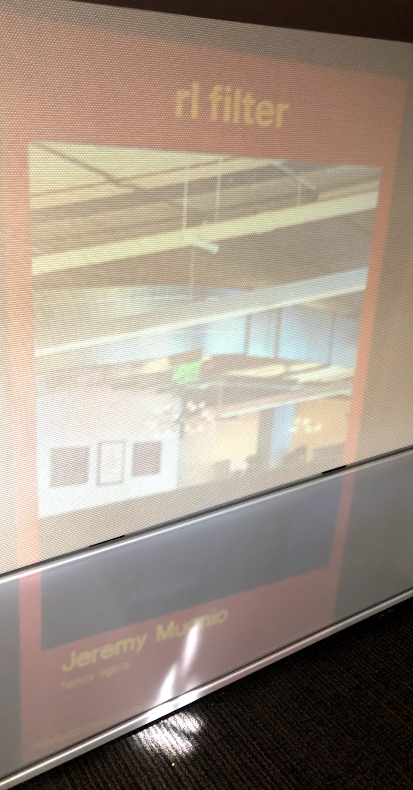

filter your pics in RL via a projector!

create a `.env` file with:

```
REACT_APP_TOKEN=your slack token!
REACT_APP_CHANNEL=the slack channel ID you want!

```

then `npm start` and go to http://localhost:3000


